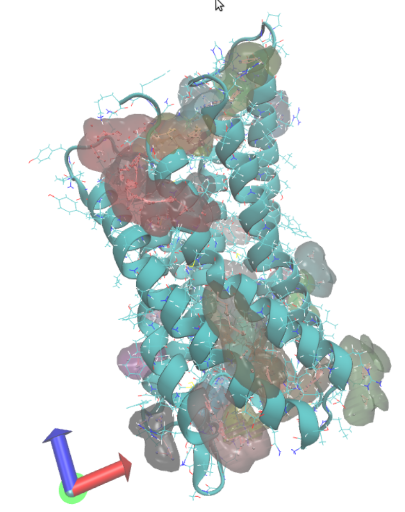
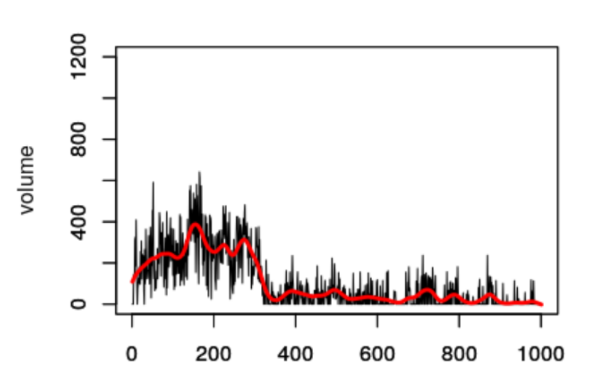

## Discovery of allosteric binding site in G-protein coupled receptors

### Aim: 
To find allosteric binding sites for the CysTLR2 receptor
### Steps:
0. CysTLR2 structure preparing
1. Run molecular dynamics (MD) for CysTLR2 
2. Apply a binding site search method to find hidden binding sites
3. Perform post-processing and statistical analysis of the results

### Methods
For MD a protein structure needs to be prepared. To begin with, we simulated the amino acid sequence [1] of a protein by the crystal structure [2] using the Modeller [3]. 
In "modelling" folder you can find model-single.py, which was used for: loops modelling, missed residuals simulating, auxiliary proteins removing and refinement.
Since GPCRs are membrane receptors, for MD it is necessary to place the receptor structure in the bilipid layer. For this, we used the CHARMM-GUI [4]. The bilipid layer was designed using the parameters described in the article [5]. 

Support files for the CHARMM-GUI, as well as the results of its work, can be found in the "gromacs" folder. Also in this folder you can find "run" script for running MD in GROMACS [6].

For binding sites searching we used fpocket [7]. 

For post-processing we used mdpocket (it's command in fpocket). For statistical analysis of the results we used "description_analysis.r" script. You can find mdpocket results and "description_analysis.r" script in "pockets"-folder.

### System requirements
python 3.8+, R 3.5+, GROMACS 5.1, fpocket 3.1

### How to reproduce

#### Step 0

To prepare CysTLR2 structure, we need to model wild type gene sequence (file `modelling/CLTR2.fasta`) the with known crystallographic structure of 6rz8 (file `modelling/6rz8.pdb`). 
1. Firstly, we have to cut auxiliary parts from 6rz8 and unnecessary parts from CLTR2 (results can be seen in files `modelling/6rz8_cutted.pdb` and `modelling/CLTR2_cutted.ali` respectively).
2. Now we have to build an alignment that would be used for modelling in future. It can be done with script `modelling/alignment.py`. Run from the `modelling` directory: ```python alignment.py```. Output file `modelling/CLTR2_6rz8.ali` contains the necessary alignment.
3. Now we are ready to perform the modelling procedure. It can be done by `modelling/model-single.py` script. Just run command ```python model-single.py``` from the `./modelling` directory. In the output file `modelling/loopmodel.final.pdb` the resulting structure could be found.

#### Step 1

Now we are ready to put `loopmodel.final.pdb` into bilipid layer and run molecular dynamic. To generate all necessary GROMACS input files we will use charmm-gui.org input generator. Choose there "Input Generator -> Membrane Builder -> Bilayer Builder", put `modelling/loopmodel.final.pdb` there and go through all configuration. As a result, you would get gromacs input files, that for our run can be found in `./gramacs` folder (all inut files except large force field and topology files, to obtain them you should go through charmm-gui by yourself). In the `gromacs/run` shell script all necessary commands to run molecular dynamics are located. Just run `./run` from `./gromacs` folder. As a result you would get a bunch of `*.trr` trajectory files (that are not included in this repo because of their large size).

#### Step 2

1. Find all pockets for our structure:

```fpocket -f example.pdb```

This command would create a folder `pockets` with all found pockets (output for our case is in folder `pockets/pockets`)

2. Perform pocket analis with mdpocket for all found pockets with shell scrip `pockets/run_all`:

```./run_all```

This would give us file descriptors for all found pockets. Our output is presented in the folder `pockets/result`

#### Step 3

Analize obtained pocket descriptor files with R script `pockets/description_analysis.r`.  

### Results

fpocket results are all of pockets of protein:


description_analysis.r allows you to analyze the time series of changes in the volume of the pocket


### Bibliography
1. https://www.uniprot.org/uniprot/Q9NS75
2. https://www.rcsb.org/structure/6RZ8
3. B. Webb, A. Sali. Comparative Protein Structure Modeling Using Modeller. Current Protocols in Bioinformatics 54, John Wiley & Sons, Inc., 5.6.1-5.6.37, 2016.
4. Jo, Sunhwan, et al. "CHARMM‐GUI: a web‐based graphical user interface for CHARMM." Journal of computational chemistry 29.11 (2008): 1859-1865.
5. Gusach, Anastasiia, et al. "Structural basis of ligand selectivity and disease mutations in cysteinyl leukotriene receptors." Nature Communications 10.1 (2019): 1-9.
6. Van Der Spoel, David, et al. "GROMACS: fast, flexible, and free." Journal of computational chemistry 26.16 (2005): 1701-1718.
7. Vincent Le Guilloux, Peter Schmidtke and Pierre Tuffery, "Fpocket: An open source platform for ligand pocket detection", BMC Bioinformatics, 2009, 10:168


